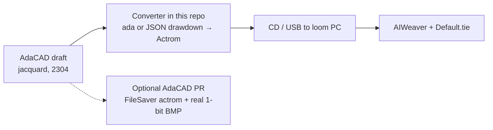

# AdaCAD → AIWeaver plan

AdaCAD can be the design tool. It cannot talk to AIWeaver today. The missing piece is an **Actrom writer** (or a converter that sits beside AdaCAD).

Clone used for this research: `2026/AdaCAD` (Unstable Design Lab monorepo). Online: [adacad.org](https://adacad.org).

## Goal

From an AdaCAD **jacquard** draft, produce files AIWeaver will load on this Concordia:

| File | Who writes it |
| --- | --- |
| `Sname.P` | New exporter / converter |
| `Dname.S01` | New exporter / converter |
| `Default.tie` | Already on the loom PC; do not invent a new one |

Constraints that must match the live machine:

- Width **2304** ends (or a repeat tiled to 2304)
- Binary lifts (`is_up`)
- Four heads are a **hook map** concern (`Default.tie`), not a second file
- Colour module unused

## What AdaCAD exports now

| Format | Direction | Use for this loom |
| --- | --- | --- |
| `.ada` | In/out | Workspace only |
| `.wif` | In/out | Shaft / dobby. Jacquard path **invents** shafts. AIWeaver will not open it |
| “Bitmap” | Out | JPEG named `*_bitmap.jpg`, not a loom file |
| PNG / PDF | Out | Print / colouring page |
| CSV | In/out | Materials |

Documented jacquard path in AdaCAD is **1 pixel per cell → Photoshop → TIFF** for a **TC2**. Their docs say they have not shipped a real BMP/TIFF download yet.

No Scotweave, Pointcarré, Actrom, or tie-file code exists in the clone.

## Internal draft (the data we would pack)

`packages/adacad-drafting-lib/src/draft/types.ts`

- `Draft.drawdown`: rows = picks (0 at top), cols = ends
- `Cell`: `{ is_set, is_up }` (`is_up` is the bit we need)
- Jacquard loom type: drawdown only, no threading / tie-up

`packages/adacad-drafting-lib/src/loom/jacquard.ts`: “draft exclusively from drawdown”.

`getDraftAsImage()` in `draft/draft.ts` already walks that grid. Origin flips live in `projects/ui/src/app/core/model/helper.ts` (`saveAsBmp`).

## Where an exporter would go

| Path | Why |
| --- | --- |
| `projects/ui/src/app/core/model/datatypes.ts` | Add `actrom` to `FileSaver` |
| `projects/ui/src/app/core/provider/file.service.ts` | Next to `dsaver.wif` / `dsaver.bmp` (~775, ~956) |
| `projects/ui/src/app/core/model/helper.ts` | `saveAsActrom` beside `saveAsWif` |
| `projects/ui/src/app/core/ui/download/download.component.ts` | Menu case |
| `projects/ui/src/app/core/ui/download/download.component.html` | “Selected Draft as Actrom” |
| `packages/adacad-drafting-lib/src/export/actrom.ts` | **Preferred**: keep packing in the library |
| `projects/livedrafting/src/runtime/download.ts` | Existing **real** 1-bit BMP (`imageDataToMonochromeBmp`); reuse for a proper bitmap export, not for AIWeaver |

`CONTRIBUTING.md` still talks about split repos; the clone is a monorepo. UI PRs still land in `projects/ui`. Library work lands in `packages/adacad-drafting-lib`.

## Actrom write spec (from the samples)

Pack `drawdown[pick][end].is_up` (treat unset as down):

1. Allocate `(wefts + 1) * 288` bytes
2. Bytes `0..287` = 0
3. For pick `i` in `0..wefts-1`, at offset `(i + 1) * 288`:
   - for end `e` in `0..2303`, if up, set bit `7 - (e % 8)` of byte `e >> 3`
4. Write `D{NAME}.S01`
5. Write `S{NAME}.P` as one ASCII line, no newline:

```
02304,{picks:05d},00001,00000,NORMAL $,????????,????????,????????,????????,????????,????????,????????,????????,00001,0
```

If the draft is not 2304 wide: tile (repeat) or reject. Do not silently pad with a different convention until we have proven origin against a woven sample.

Bit order and pick origin must be proven on the loom with a tiny test (one pick, one end) before trusting a full cloth. The sample files imply **end 0 = MSB of byte 0**, **pick 0 after the blank row**.

## Recommended delivery (two tracks)



### Track A: converter here (do first)

A small script in this repo, no AdaCAD merge required.

- Input: exported drawdown (`.ada` node, or a JSON dump of `is_up` rows, or a 2304-wide 1-bit image once AdaCAD can emit one)
- Output: `Sname.P` + `Dname.S01` that match `SCARBCAR` structurally
- Golden tests: round-trip the three sample `.S01` files and a synthetic “end 0 pick 0 only” file
- Copy to the loom PC, load with existing `Default.tie`

This unblocks designing without waiting on review.

### Track B: upstream AdaCAD (offer once A works)

1. Real 1-bit BMP/TIFF export (they already document this as missing; livedrafting has the encoder)
2. Actrom as a third “Selected Draft as…” item, width check 2304, write the pair

Actrom is niche (Albany / Martel). Lead with the bitmap fix; keep Actrom optional or behind a “industrial / Actrom” label. Contact: Unstable Design Lab / AdaCAD Discord (you have already spoken to them).

WIF is a dead end for this controller.

## Acceptance

| Check | Pass |
| --- | --- |
| AIWeaver opens the `.p` without “invalid ACTROM” / missing data | Yes |
| Declared picks match `.S01` | `(size / 288) - 1` |
| Heddles match `Default.tie` | 2304 |
| `SYARBYAR`-style single-end file lifts the expected head | Proven on the machine, air off first |
| AdaCAD origin option matches woven front | After first cloth |

## Out of scope

- Regenerating `Default.tie`
- Colour / special-command fields in the `.p` (`????????`)
- RAT files
- Talking to the 1710 from AdaCAD (AdaCAD never runs on the loom PC)

## Suggested first implementation ticket

1. Parse / emit `.p` + `.S01` in this repo with unit tests against `SCARBCAR` / `SROWBYRO` / `SYARBYAR`
2. Add a “dump drawdown JSON” path or read `.ada` compressed drawdown
3. Weave a one-pick diagnostic before any real design
4. Then decide whether to PR AdaCAD or keep the converter
