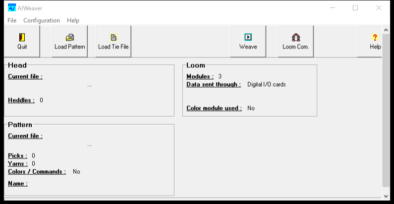
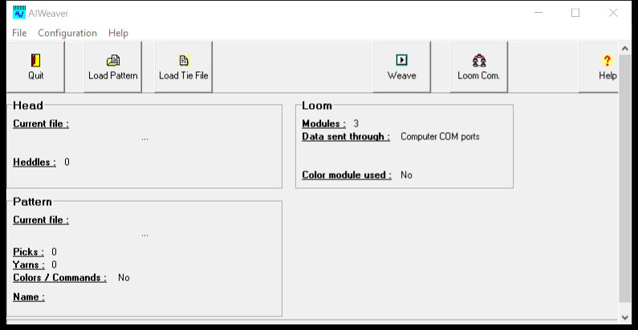
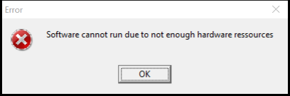

# AIWeaver configuration

## Live settings (loom PC, October 2026)

| Field | Value | Notes |
| --- | --- | --- |
| Data sent through | Digital I/O cards | Required. The jacquard is on the 1710 50-pin, not COM |
| Modules | **4** | Four heads, four cable sets |
| Colour module used | No | 1500 / colour path unused |
| Heddles | 2304 | After `Default.tie` |
| Yarns | 2304 | After pattern load; `4 × 576` |
| Machine | the salvaged patchwork old machine PC tower | Windows 2000 |



The local mock used Modules = 3 because the drawings we had were a 3-head variant. The physical machine is 4-head. Same total hook count.





## Why Digital I/O was grey

The Communications radio **I have digital I/O card(s) in my computer** is enabled only if AIWeaver’s 1710 (or 1500) count is greater than zero.

| Situation | What you see |
| --- | --- |
| Stub says 0 × 1500, 1710 DLL missing | Loader error (never get this far) |
| Both DLLs load, ADDIREG list empty | Digital I/O grey, COM selected |
| ADDIREG has APCI1710 | Digital I/O clickable |

COM ports is also the factory `AIWeaver.reg` default (`ConfigID = 2`). You cannot force Digital I/O while the count is zero. After registration, select Digital I/O, **OK**, quit, reopen.

First start after the switch may show board / module initialisation errors. **OK** through them, save, reopen. A clean second start is expected: the card is already programmed and `ConfigID` matches.

Weaving on COM ports on this loom will fail with “Communication failed on first…fourth COM port”.

## Registry

`HKEY_CURRENT_USER\Software\AIWeaver`

| Name | Role |
| --- | --- |
| `ConfigID` | Last comms / hardware mode. `0` ≈ Digital I/O in local tests |
| `Modules` | Jacquard heads to drive |
| `ColorModuleUsed` | `0` on this machine |
| `PatternPath` | Last pattern |
| `TieFilePath` | Last tie |
| `EncoderClockMounted` | Sensor present (default 1 on the install REG) |
| `COMBaudrate` | Only for COM mode |
| `ShutDownAfterQuit` | Optional |

The install file `AIWeaver.reg` ships `ConfigID=2` (COM) and `Modules=3`. The live machine now differs (Digital I/O, Modules = 4). Prefer the UI (**Configuration** / **Loom Com.**) over hand-editing.

## Modules: 4 vs 3 vs “four chips”

**Modules** is the number of **jacquard heads** AIWeaver will clock. It is not the four function modules (FM0–FM3) on the 1710 card. That card always has four FPGA blocks; AIWeaver initialises all four as digital I/O regardless.

| Split | Total hooks |
| --- | --- |
| 3 × 768 | 2304 (drawings: “Configuration 3 modules”) |
| **4 × 576** | **2304 (this machine)** |

Four heads and 2304 yarns/heddles line up. Do not set Modules back to 3: that would only drive three of the four cable sets.

Colour module is a different thing (1500-era extra channel). Keep it **No**.

## Files that must sit next to `AIWeaver.exe`

```
C:\Program Files\AIWeaver\
  AIWeaver.exe
  APCI1500.DLL          stand-in
  APCI1710.DLL          real ADDI DLL
  DGI_IO.CFG
  Default.tie
  SCARBCAR.P / SROWBYRO.P / SYARBYAR.P
  DCARBCAR.S01 / …      matching data files
  APCI1500_stub.log     created at run
```

Shortcut **Start in** must be that folder so `DGI_IO.CFG` resolves by bare name.

## First-run errors

Expected the first time Digital I/O talks to a newly registered card:

- `APCI1710 board … SetBoardInformation Error`
- `APCI1710 board … module … Initialisation Error`

If they vanish on the next start, treat them as programming noise. If they persist, SET1710’s board list and `DGI_IO.CFG` location are the first checks.

## Next functional test (not done)

1. Load `Default.tie` (already lines up at 2304)
2. Load a sample Actrom (`SCARBCAR.P` is a card-by-card test)
3. Only then **Weave**, with air / stops under control
