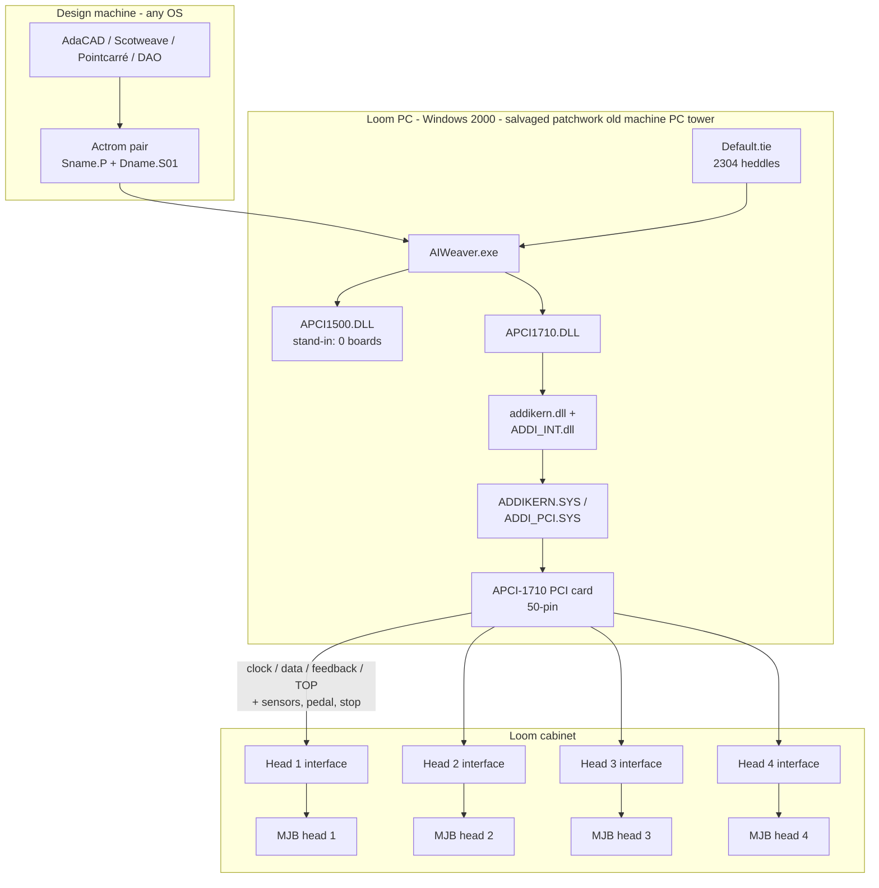
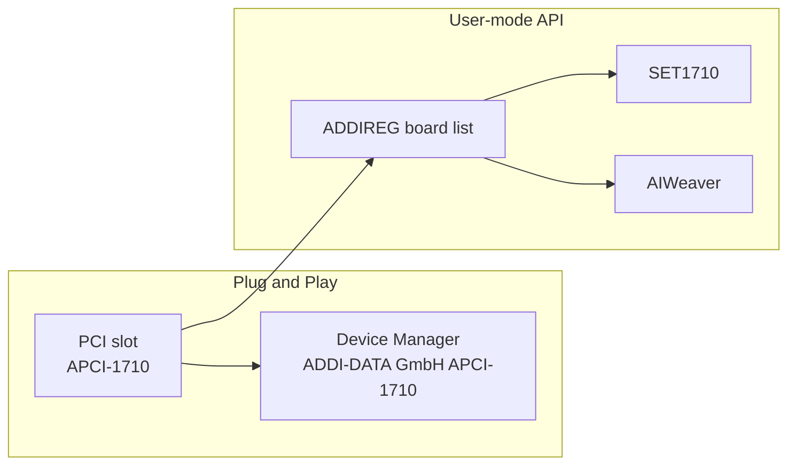
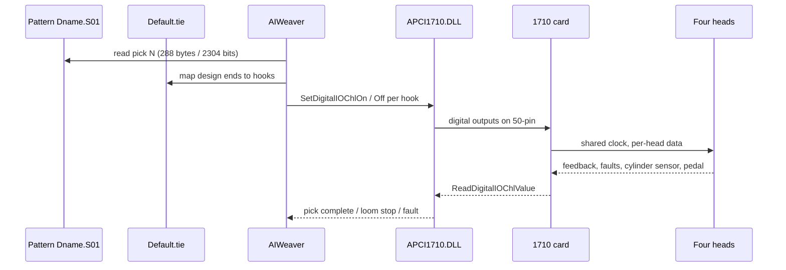

# System architecture

The installation is a **PC-controlled jacquard**. AIWeaver on Windows 2000 is the loom controller. Pattern CAD (historically Scotweave / Pointcarré / Albany DAO; planned: AdaCAD) is a separate step that only produces files.

This diagram is a **reconstruction**. Nobody handed over a current system drawing. It was assembled from the schematic scan, the ADDI CD, `AIWeaver.exe`, and what is actually plugged in. In **late 2024 to early 2025** the first plan was to run the old OS in a VM, because that looked more affordable and maintainable. That died on the PCI data card. The PC in this picture is the salvaged patchwork old machine PC tower, a real Windows 2000 tower built so the card could sit in a real slot. A virtualised controller can still be a later upgrade. See [recovery.md](recovery.md).

## Whole system

The drawings call those interface boxes **ICR** (*interface de commande ratière*, Martel Catala). On the machine they are the boxes with the 25-pin plugs and the 5 V / 15 V / DATA / CLOCK / FEEDBACK / TOP LEDs. There are **four**, one per head.

## Schematic scan

Pages: [`aiweaver-shim/schematics/`](aiweaver-shim/schematics/). This is a **3-head electrical box**, not a drawing of this 4-head machine.

| Sheets | Contents |
| --- | --- |
| Index | 15 V supply, 5 V supply, APCI-1710 connector, jacquard interface modules 1–3, cylinder sensor |
| 15 V power | 20 V in, EWS 300/15V supplies, 24 V |
| 50-pin | Clock, data, and feedback per module, plus stop, fault, and the cylinder |
| Later sheets | MJB heads, ends per cm, which harness holes are used |

Use the scan for signals and supplies. Use the live machine for the head count: 4 × 576.

## Two ADDI stacks

Windows can “see” the card in two different ways. Both have to work.

| Stack | What it answers | If it fails |
| --- | --- | --- |
| Device Manager | Is there a PCI device and a `.sys` bound to it? | Yellow `!`, or no ADDI group |
| ADDIREG list | May SET1710 / AIWeaver open the board? | “No APCI-1710 found”, Digital I/O greyed out |

In October 2026 Device Manager was already healthy and ADDIREG’s table was **empty**. That single gap blocked Digital I/O. Inserting **APCI1710** (slot **131**) filled it.

ADDI’s own CD text says ADDIREG is “not used” for PCI boards under Windows 2000. That is only true for **installing** the Plug and Play driver. The **programming API** still reads the ADDIREG list.

## Data path when weaving

The 1710 is powered by the PC. Loom / mainframe power only energises the interface boxes, valves, and sensors. It does **not** hide the PCI card. Leave loom power off until you mean to move the jacquard.

## What AIWeaver is not

AIWeaver is not a design program. It loads a finished lift plan and a harness map, then clocks bits out to the heads.

| Role | Program |
| --- | --- |
| Draw the cloth | AdaCAD (planned), historically Scotweave / Pointcarré / DAO |
| Map ends to hooks | `Default.tie` (loom dressing, rarely changed) |
| Run the loom | AIWeaver |

See [file formats](file-formats.md) and [AdaCAD plan](adacad.md).
