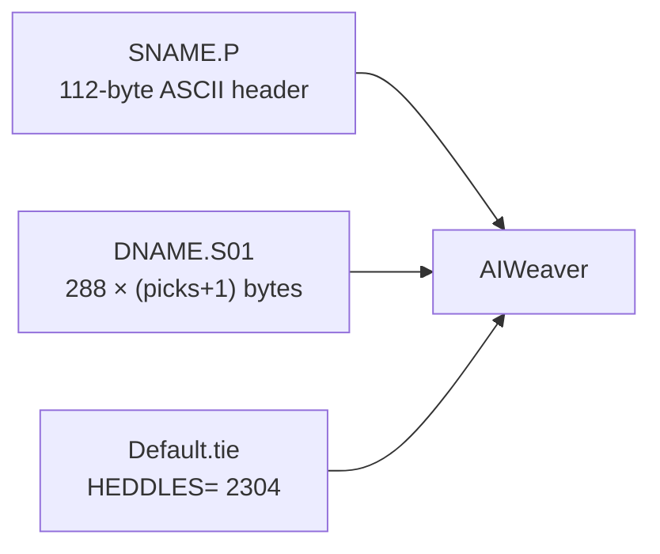

# File formats

AIWeaver does not open Scotweave, Pointcarré, WIF, BMP, or TIFF. The load dialogs are:

```
Actrom file (*.p)|*.p|Rat file (*.rat)|*.rat
Head file (*.tie)|*.tie
```

Albany **DAO** (`F1299_DAO.exe`) saves `Actrom files (*.s01)`. Historical path: CAD → Actrom → AIWeaver.

## Pattern: `Sname.P` + `Dname.S01`

The `.p` file is a **header**. The lifts are in a sibling data file. `SCARBCAR.P` expects `DCARBCAR.S01` in the same folder. Missing data → “One ACTROM data file is missing”.

### Header (`.p`)

112 bytes, ASCII, no newline, 15 comma-separated fields. Samples:

```
02304,00024,00001,00000,NORMAL $,????????,????????,????????,????????,????????,????????,????????,????????,00001,0
02304,02304,00001,00000,NORMAL $,????????,????????,????????,????????,????????,????????,????????,????????,00001,0
```

| Field | Sample | Meaning |
| --- | --- | --- |
| 1 | `02304` | Ends / heddles (must match the tie) |
| 2 | `00024` or `02304` | Pick count |
| 3 | `00001` | Number of data disks / `.S01` files |
| 4 | `00000` | Yarns (0 → “this pattern file has no yarns”) |
| 5 | `NORMAL $` | Weave mode |
| 6–13 | `????????` | Unused / colour-command slots |
| 14–15 | `00001`,`0` | Trailing flags |

### Lift data (`.S01`)

Bit-packed, MSB first (bit 7 of byte 0 = end 0).

- 2304 bits per pick = **288 bytes**
- **One empty 288-byte block first**, then one block per pick
- Size: `(picks + 1) × 288`

| Sample | Picks in `.p` | File size |
| --- | --- | --- |
| `DCARBCAR.S01` | 24 | 7200 = 25 × 288 |
| `DROWBYRO.S01` | 24 | 7200 |
| `DYARBYAR.S01` | 2304 | 663840 = 2305 × 288 |

The three samples are loom tests, not cloth:

| File | What each pick does |
| --- | --- |
| `SYARBYAR` | Pick *n* lifts only end *n* (yarn by yarn) |
| `SCARBCAR` | Pick *n* lifts every 24th end, offset *n* (one harness card) |
| `SROWBYRO` | Pick *n* lifts four 24-end runs, one in each quarter |



`.rat` is accepted by the same dialog. There is no sample on the install disc; leave it alone unless a file appears.

## Tie: `Default.tie`

ASCII, CRLF. First line:

```
HEDDLES= 2304
```

Then a **96 × 24** grid of the unique integers 1–2304 (tab-separated). It is the **harness dressing**: design column → physical hook.

This is loom-specific. AdaCAD does not need to generate it unless the machine is re-tied. Reuse `Default.tie`.

2304 on this machine is **4 heads × 576 hooks**, not 3 × 768. Same total, different split. The drawings labelled “Configuration 3 modules” are the same family, fewer heads. See [architecture](architecture.md).

## What “Load Pattern” / “Load Tie File” should show

| After | Head panel | Pattern panel |
| --- | --- | --- |
| `Default.tie` | Heddles = 2304 | n/a |
| `SCARBCAR.P` | n/a | Picks = 24, yarns = 2304 if declared |

Mismatched heddle counts → “Heddles count does not match”. Mismatched picks vs `.S01` → “Declaration and effective pick count do not match”.

## Not used by AIWeaver

WIF, AdaCAD `.ada`, JPEG/PNG “bitmaps”, TIFF (TC2), Scotweave / Pointcarré natives. Those are CAD interchange. They become useful only after a converter writes Actrom. See [adacad.md](adacad.md).
