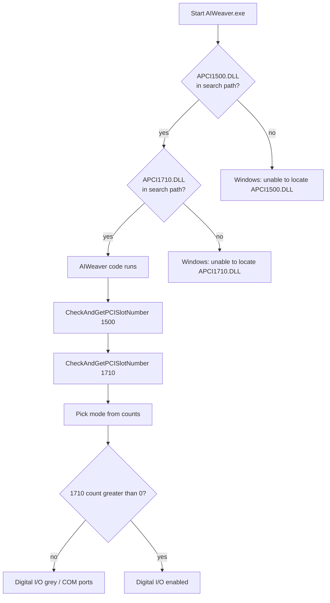

# Recovery log

This page is the **chronological** story of how a dead Concordia got as far as AIWeaver talking to a real APCI-1710. The later mechanism pages ([windows-loader.md](windows-loader.md), [addi-drivers.md](addi-drivers.md)) are what we now *think* is true. They are not a vendor manual.

## How this knowledge was made

Everything here is **ad-hoc reverse engineering**. There was no official Albany / Martel / ADDI integration guide for this install. The starting kit was:

- a loom that had sat unused
- a handful of discs and random notes
- a schematic PDF scan, now [`aiweaver-shim/schematics/`](aiweaver-shim/schematics/) (see [architecture](architecture.md))
- error dialogs
- trial and error

This began about **one to two years into learning to code**. The work was not a planned systems project. It was “make the old thing talk again”, one stuck point at a time.

The **VM work was late 2024 to early 2025**: learning virtualisation, getting Windows 2000/XP running from an Internet Archive ISO, and getting the design software to install inside the guest. Early research notes (VM setup, serial passthrough, compressor questions) still exist as a dump titled *Legacy Loom Integration Project Support* (VirtualBox, XP, serial, and air-compressor links). Treat that file as a **period document**, not as current procedure.

None of the later “we now know X” statements were known at the start.

Air work ran **in parallel** with the computer work, and is now resolved (see [Air and compressor](#air-and-compressor-in-parallel)).

---

## 1. First idea: virtualise the old OS (late 2024 to early 2025)

The one thing that was clear early: **AIWeaver needs an old Windows**. The installer and the ADDI stack are Windows 2000-era. This phase ran from **late 2024 into early 2025**.

Virtualisation looked like the sane first path: a modern laptop, no hunting for dead hardware, more affordable, and easier to keep going long term. Several people had already suggested building a period PC instead. That advice was set aside until the VM had been tried.

That meant learning a pile of new things at once:

- hypervisors (VirtualBox and similar)
- 32-bit guest OSes
- ISOs, boot order, Guest Additions
- shared folders, serial ports, USB passthrough
- where to get a legal-enough old OS image

A **Windows 2000** (and/or XP) ISO from the **Internet Archive** / similar archives got a guest running. That was a real milestone: the old OS booted, and **design-side software could be installed and used inside the VM**.

The contemporary notes assume a serial link into the VM (direct COM passthrough, USB-to-serial, or a virtual COM port) and treat “get XP/2000 running in VirtualBox” as the main problem. That matches where the project actually was.

## 2. The wall: the data card is not a serial port (early 2025)

The loom does not hang off a generic COM port. It hangs off a **proprietary ADDI-DATA PCI card** (APCI-1710) with its own kernel driver.

You can pass a USB-serial adapter into a VM. You cannot usefully “virtualise” that PCI card:

- the guest needs the real ADDI kernel driver
- the driver needs the real PCI device
- consumer hypervisors do not present an APCI-1710 to Windows 2000

That is where the VM path stalled. The OS and the CAD/controller *binaries* were solvable. The **I/O device** was not. The serial-port questions in the early notes sit in that grey area: the contemporary research still assumed a COM link into the guest, because that is what the notes and the software dialogs made it look like.

## 3. Change of plan: a physical old PC (after the VM wall)

When the data card and that serial-port grey area would not move, the project leaned into hardware: get it working on a real machine first, and treat a later virtualised or upgraded controller as a future step rather than the first one.

Tony came on board around this point. He is the person who swayed the hardware decision, after several people had already suggested it: stop fighting the VM and **build a period machine**, an old tower that can take a real PCI card, running Windows 2000 natively.

A few iterations of scavenging / buying a box later, that machine existed: the salvaged patchwork old machine PC tower. An **APCI-1710 was ordered from ADDI-DATA**.

That decision is why the later software work is on bare metal, not in VirtualBox.

## 4. Card arrives (about April 2026)

The card showed up around **April 2026**. From here the problems look like “software version” and “installer” problems, because those are the dialogs Windows shows.

Typical early physical-PC attempts:

| What we tried | What the dialog said | What we thought |
| --- | --- | --- |
| Install AIWeaver on a newer Windows | OS not adequate / MSI error 1406 | Need a patched XP installer |
| Run AIWeaver | Unable to locate `APCI1500.DLL` | This build is 1500-only; we have the wrong card or the wrong disc |
| ADDI 1500 packages | This PC has no 1500 | Maybe we need that card too |
| Rename `APCI1710.DLL` → `APCI1500.DLL` | Entry point `i_APCI1500_*` not found | Still the wrong driver file |

Those guesses were reasonable from the **surface wording**. They were wrong about the **loader**. See [windows-loader.md](windows-loader.md).

Renaming was a useful negative: the two DLLs export **different names**. AIWeaver wants **both** libraries present. It does not want one library wearing two names.

## 5. Re-read (September 2026)

A closer look at `AIWeaver.exe` (imports and call sites, not the disc label) showed:

- static imports of **both** `APCI1500.DLL` and `APCI1710.DLL`
- full 1710 digital-I/O support already in the EXE
- mode picked by **counting** boards: one 1710 + zero 1500 → 1710-only path
- Windows never runs AIWeaver until every static import exists, and it only names the **first** missing file

So the 1500 error was hiding the 1710 error. The program was not a “wrong generation”.

A stand-in `APCI1500.DLL` was built and burned to CD. It only answers “0 boards”. That unblocks the **loader**, nothing else.

## 6. Loader, then packages, then registry (September to October 2026)

| When | What we did | What it actually meant |
| --- | --- | --- |
| September 2026 | Stub on the loom PC | Next error: missing `APCI1710.DLL` (as predicted) |
| September 2026 | 1710 setup from the ADDI CD offers uninstall | Driver **package** already registered; files not next to AIWeaver |
| Local test | Mock 1710 + real `AIWeaver.exe` | 1710-only path is real; Digital I/O ≈ ConfigID 0 |
| October 2026 | AIWeaver opens; Digital I/O grey; stub log `0 boards` | Stub correct; 1710 **API** count is 0 |
| October 2026 | Copy `APCI1710.DLL` into the AIWeaver folder | Imports succeed; API still 0 boards |
| October 2026 | Device Manager: APCI-1710, no yellow mark | Plug and Play stack is fine |
| October 2026 | SET1710: “no APCI-1710 found” | User-mode stack not attached |
| October 2026 | ADDIREG table **empty**; Insert APCI1710 → slot **131**; Set; Save; Test | This is the list SET1710 / AIWeaver actually read |
| October 2026 | First AIWeaver start: a few OK-able errors; select Digital I/O; save | Card programmed (`DGI_IO.CFG`) |
| October 2026 | Second start: no errors | Config persisted |
| October 2026 | Modules **4**, heddles/yarns **2304**, four heads / four cable sets | Live dressing; the drawings we had were a 3-head variant |

Why the April–September analysis stayed wrong: we treated “the disc mentions 1500” as “this build is 1500-only”. The later pass asked a different question: **what must exist before `WinMain`, and what does the program call after that?**

The 1500 **file** is required by the PE import table. The 1500 **board** is optional.

## 7. Air and compressor (in parallel, now resolved)

While the computer side was stuck on VMs and then on DLL errors, the **pneumatic** side was a second project.

The old documentation listed a pressure figure around **3000 PSI**. To someone who is not a pneumatics person, that reads like industrial high-pressure plant: the kind of compressor you would not keep in a studio, plus a serious water-filter chain so moisture would not wreck the jacquard.

A lot of time went into that reading:

- looking at industrial-scale / high-pressure units
- trying to **design a water-filter chain** that could stand in for building air

That was a misread of what the figure actually meant for this machine. The air side is **now resolved**. AIWeaver can open without compressed air. Air is still required before a real weave: the heads are pneumatic, and pin 38 on the 1710 can switch cylinder valves. Do not treat a clean AIWeaver start as permission to pressurise the loom.

The early support notes already list “air compressor system: pressure, flow, integration” next to the serial-port questions. Both tracks were in the same pile of notes from the beginning.

## What is still untested

- Weaving with loom / air on
- Live pulse timing, feedback, cylinder sensor, pedal
- A new design from AdaCAD (no Actrom exporter yet)

Do not treat a clean AIWeaver start as “the loom weaves”.
